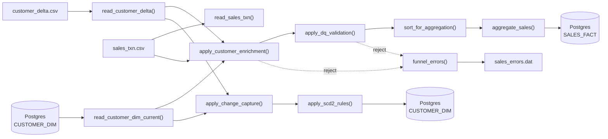

# DataStage → PySpark Migration

> **Pipeline:** JB_CUST_SALES_SCD_AGG  
> **Source:** IBM DataStage 11.7.1  
> **Target:** Apache Spark (PySpark) + PostgreSQL (JDBC)  
> **Generated:** 2026-07-28  

## Overview

Automated migration of a Customer/Sales ETL pipeline from IBM DataStage to plain PySpark + PostgreSQL. The pipeline handles:

- **Two CSV source feeds** (customer delta + sales transactions)
- **Reference lookup enrichment** with reject handling (JDBC)
- **Data quality validation** with reject handling
- **SCD Type 2** customer dimension maintenance (Change Capture + Surrogate Key Generator + two-way expire/insert)
- **Sort + aggregation** to a sales fact table
- **Centralized error funnel** capturing rejects into a dedicated file

**No Databricks, no Snowflake, no dbutils.** Plain `spark.read.csv`, `spark.read.jdbc`, `df.write.jdbc`.

## Repository structure

```
artifacts/
├── 01-discovery/       # Source scan, inventory, schema catalog, data flows, analytics
├── 02-design/          # Stage-to-PySpark mapping, target architecture, feasibility report
├── 03-build/           # Generated pyspark_emp_load.py script + build/migration reports
├── 04-deploy/          # Dockerized deploy bundle + CI/CD pipelines + deploy manifests
│   ├── package/        # Dockerfile, entrypoint.sh, config, sample data, deploy manifests
│   └── datastage-pyspark-deploy-bundle.zip  # Single download artifact
└── DS_Job_XML.xml     # Original DataStage DSExport XML
```

## Quick start

```bash
cd artifacts/04-deploy/package
cp config/.env.example config/.env
# Edit config/.env with your Postgres connection details

docker build -t datastage-pyspark .
docker run --rm --env-file config/.env datastage-pyspark
```

## Pipeline at a glance



## Stats

| Metric | Value |
|---|---|
| Stages | 14 |
| Links | 16 |
| Schemas | 7 (58 fields) |
| Sinks | 3 (2 PostgreSQL tables + 1 error log) |
| PySpark functions | 17 |
| Automation feasibility | 75% |

## Deployment

CI/CD pipelines included for:
- **AWS:** ECR + ECS Fargate (GitHub Actions)
- **Azure:** ACR + Container Apps Jobs (GitHub Actions / Azure Pipelines)
