# Dependency Graph &mdash; JB_CUST_SALES_SCD_AGG

> **Stage:** Data Flows (discovery / data-flows)  
> **Date:** 2026-07-28  
> **Nodes:** 19 &emsp; **Edges:** 22  

---

## Topology

```mermaid
flowchart LR
  F1["customer_delta_#RUN_DATE#.dat\n(CSV)"] --> S1["STG_SRC_CUSTOMER_DELTA\n(PxSequentialFile)"]
  F2["sales_txn_#RUN_DATE#.dat\n(CSV)"] --> S2["STG_SRC_SALES_TXN\n(PxSequentialFile)"]
  DB1[("CUSTOMER_DIM\n(Postgres)")] -->|reads JDBC| S3["STG_REF_CUST_DIM_CURRENT\n(PxDB2Connector)"]

  S1 -->|lnk_CustDelta_Out| LKP["LKP_CUSTOMER_ENRICH\n(PxLookup)"]
  S2 -->|lnk_SalesTxn_Out| LKP
  S3 -->|lnk_CustDimCurrent_Out| LKP
  LKP -->|lnk_Enriched_Out| XFM1["XFM_DQ_VALIDATION\n(PxTransformer)"]
  LKP -.->|lnk_Enrich_Reject ✗| FUN["FUN_ERROR_FUNNEL\n(PxFunnel)"]

  XFM1 -->|lnk_DQ_Pass| SRT["SRT_SALES_ENRICHED\n(PxSort)"]
  XFM1 -.->|lnk_DQ_Reject ✗| FUN

  S1 -->|lnk_After_CustDelta| CHG["CHG_CUST_SCD_COMPARE\n(PxChangeCapture)"]
  S3 -->|lnk_Before_CustDimCurrent| CHG
  CHG -->|lnk_ChangeOut| XFM2["XFM_SCD_APPLY\n(PxTransformer)"]
  GEN["GEN_SURR_KEY\n(PxSurrogateKeyGenerator)"] -->|lnk_SurrKeyOut| XFM2

  XFM2 -->|lnk_ExpireRow| SK1["TGT_CUSTOMER_DIM\n(PxDB2Connector)"]
  XFM2 -->|lnk_NewVersionRow| SK1

  SRT -->|lnk_Sorted_Out| AGG["AGG_SALES_SUMMARY\n(PxAggregator)"]
  AGG -->|lnk_Aggregated_Out| SK2["TGT_SALES_FACT\n(PxDB2Connector)"]

  FUN -->|lnk_FunnelOut| SK3["TGT_ERROR_LOG\n(PxSequentialFile)"]

  SK1 -->|writes JDBC| DB1
  SK2 -->|writes JDBC| DB2[("SALES_FACT\n(Postgres)")]
  SK3 -->|writes| F3["sales_errors_#RUN_DATE#.dat\n(CSV)"]

  style FUN fill:#f96,stroke:#c00,color:#000
  style SK3 fill:#f96,stroke:#c00,color:#000
```

---

## Edge table

| From | To | Relationship |
|---|---|---|
| customer_delta_#RUN_DATE#.dat | STG_SRC_CUSTOMER_DELTA | reads |
| sales_txn_#RUN_DATE#.dat | STG_SRC_SALES_TXN | reads |
| CUSTOMER_DIM (Postgres) | STG_REF_CUST_DIM_CURRENT | reads (JDBC) |
| STG_SRC_CUSTOMER_DELTA | LKP_CUSTOMER_ENRICH | link (lnk_CustDelta_Out) |
| STG_SRC_SALES_TXN | LKP_CUSTOMER_ENRICH | link (lnk_SalesTxn_Out) |
| STG_REF_CUST_DIM_CURRENT | LKP_CUSTOMER_ENRICH | link (lnk_CustDimCurrent_Out) |
| LKP_CUSTOMER_ENRICH | XFM_DQ_VALIDATION | link (lnk_Enriched_Out) |
| LKP_CUSTOMER_ENRICH | FUN_ERROR_FUNNEL | reject (lnk_Enrich_Reject) |
| XFM_DQ_VALIDATION | SRT_SALES_ENRICHED | link (lnk_DQ_Pass) |
| XFM_DQ_VALIDATION | FUN_ERROR_FUNNEL | link (lnk_DQ_Reject) |
| STG_REF_CUST_DIM_CURRENT | CHG_CUST_SCD_COMPARE | link (lnk_Before_CustDimCurrent) |
| STG_SRC_CUSTOMER_DELTA | CHG_CUST_SCD_COMPARE | link (lnk_After_CustDelta) |
| CHG_CUST_SCD_COMPARE | XFM_SCD_APPLY | link (lnk_ChangeOut) |
| GEN_SURR_KEY | XFM_SCD_APPLY | link (lnk_SurrKeyOut) |
| XFM_SCD_APPLY | TGT_CUSTOMER_DIM | link (lnk_ExpireRow) |
| XFM_SCD_APPLY | TGT_CUSTOMER_DIM | link (lnk_NewVersionRow) |
| SRT_SALES_ENRICHED | AGG_SALES_SUMMARY | link (lnk_Sorted_Out) |
| AGG_SALES_SUMMARY | TGT_SALES_FACT | link (lnk_Aggregated_Out) |
| FUN_ERROR_FUNNEL | TGT_ERROR_LOG | link (lnk_FunnelOut) |
| TGT_CUSTOMER_DIM | CUSTOMER_DIM (Postgres) | writes (JDBC) |
| TGT_SALES_FACT | SALES_FACT (Postgres) | writes (JDBC) |
| TGT_ERROR_LOG | sales_errors_#RUN_DATE#.dat | writes |

**Legend:** Solid = output link; Dashed = reject; Orange = error/reject path.
