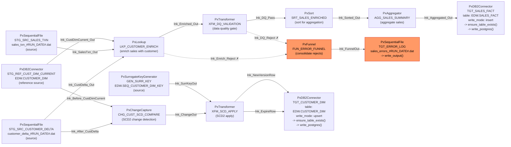

# Discovery: Data Flows &mdash; JB_CUST_SALES_SCD_AGG

> **Stage:** Data Flows (discovery / data-flows)  
> **Date:** 2026-07-28  
> **Source platform:** IBM DataStage  
> **Target platform:** Postgres PySpark  

---

## Pipeline DAG

**Legend:** Solid edges = Output links; Dashed edges = Reject links; Orange nodes = error/reject path

---

## Source stage: STG_SRC_CUSTOMER_DELTA (PxSequentialFile)

- **Kind:** file (CSV/sequential)
- **File:** `#SRC_DIR#/customer_delta_#RUN_DATE#.dat`
- **Delimiter:** `,` · **Header:** yes · **Null marker:** NULL · **Encoding:** UTF-8
- **Date format (Spark):** `yyyy-MM-dd`
- **Read method:** Specific Files
- **Generated method:** `read_source()`

## Source stage: STG_SRC_SALES_TXN (PxSequentialFile)

- **Kind:** file (CSV/sequential)
- **File:** `#SRC_DIR#/sales_txn_#RUN_DATE#.dat`
- **Delimiter:** `,` · **Header:** yes · **Null marker:** NULL · **Encoding:** UTF-8
- **Date format (Spark):** `yyyy-MM-dd`
- **Read method:** Specific Files
- **Generated method:** `read_source()`

## Source stage: STG_REF_CUST_DIM_CURRENT (PxDB2Connector)

- **Kind:** database (JDBC reference)
- **Connection:** `#DB_CONNECTION#` · **Table:** EDW.CUSTOMER_DIM
- **Select:** `SELECT CUST_KEY, CUST_ID, CUST_NAME, ADDRESS, CITY, STATE, ZIP, SEGMENT, EFF_DATE, EXP_DATE, CURR_FLAG FROM EDW.CUSTOMER_DIM WHERE CURR_FLAG = 'Y'`
- **Generated method:** `read_reference()`

## Source stage: GEN_SURR_KEY (PxSurrogateKeyGenerator)

- **Kind:** generated (no physical read)
- **Key source:** Db2Sequence · **Sequence:** EDW.SEQ_CUSTOMER_DIM_KEY
- **Output column:** NEW_CUST_KEY
- **Generated method:** `generate_output()`

---

## Sink stage: TGT_CUSTOMER_DIM (PxDB2Connector)

- **Kind:** database
- **Target table:** EDW.CUSTOMER_DIM
- **Write mode:** upsert &rarr; PySpark disposition: **UNSUPPORTED** (requires merge/MERGE-INTO logic, redesign band)
- **Upsert key columns:** CUST_KEY
- **Generated methods:** `ensure_table_exists()` + `write_postgres()`

## Sink stage: TGT_SALES_FACT (PxDB2Connector)

- **Kind:** database
- **Target table:** EDW.SALES_FACT
- **Write mode:** insert &rarr; PySpark disposition: `.mode("append")`
- **Generated methods:** `ensure_table_exists()` + `write_postgres()`

## Sink stage: TGT_ERROR_LOG (PxSequentialFile)

- **Kind:** file
- **Target file:** `#ERR_DIR#/sales_errors_#RUN_DATE#.dat`
- **Write mode:** overwrite &rarr; PySpark disposition: `.mode("overwrite")`
- **Generated method:** `write_output()`

---

## Link: lnk_CustDelta_Out

- **From:** STG_SRC_CUSTOMER_DELTA
- **To:** LKP_CUSTOMER_ENRICH
- **Link type:** Output
- **Generated method:** `apply_transformations()`

## Link: lnk_SalesTxn_Out

- **From:** STG_SRC_SALES_TXN
- **To:** LKP_CUSTOMER_ENRICH
- **Link type:** Output
- **Generated method:** `apply_transformations()`

## Link: lnk_CustDimCurrent_Out

- **From:** STG_REF_CUST_DIM_CURRENT
- **To:** LKP_CUSTOMER_ENRICH
- **Link type:** Output
- **Generated method:** `apply_transformations()`

## Link: lnk_Enriched_Out

- **From:** LKP_CUSTOMER_ENRICH
- **To:** XFM_DQ_VALIDATION
- **Link type:** Output
- **Generated method:** `apply_transformations()`

## Link: lnk_Enrich_Reject

- **From:** LKP_CUSTOMER_ENRICH
- **To:** FUN_ERROR_FUNNEL
- **Link type:** Reject
- **Generated method:** `route_reject()`

## Link: lnk_DQ_Pass

- **From:** XFM_DQ_VALIDATION
- **To:** SRT_SALES_ENRICHED
- **Link type:** Output
- **Generated method:** `apply_transformations()`

## Link: lnk_DQ_Reject

- **From:** XFM_DQ_VALIDATION
- **To:** FUN_ERROR_FUNNEL
- **Link type:** Output
- **Generated method:** `apply_transformations()`

## Link: lnk_Before_CustDimCurrent

- **From:** STG_REF_CUST_DIM_CURRENT
- **To:** CHG_CUST_SCD_COMPARE
- **Link type:** Input
- **Generated method:** `apply_transformations()`

## Link: lnk_After_CustDelta

- **From:** STG_SRC_CUSTOMER_DELTA
- **To:** CHG_CUST_SCD_COMPARE
- **Link type:** Input
- **Generated method:** `apply_transformations()`

## Link: lnk_ChangeOut

- **From:** CHG_CUST_SCD_COMPARE
- **To:** XFM_SCD_APPLY
- **Link type:** Output
- **Generated method:** `apply_transformations()`

## Link: lnk_SurrKeyOut

- **From:** GEN_SURR_KEY
- **To:** XFM_SCD_APPLY
- **Link type:** Output
- **Generated method:** `apply_transformations()`

## Link: lnk_ExpireRow

- **From:** XFM_SCD_APPLY
- **To:** TGT_CUSTOMER_DIM
- **Link type:** Output
- **Generated method:** `apply_transformations()`

## Link: lnk_NewVersionRow

- **From:** XFM_SCD_APPLY
- **To:** TGT_CUSTOMER_DIM
- **Link type:** Output
- **Generated method:** `apply_transformations()`

## Link: lnk_Sorted_Out

- **From:** SRT_SALES_ENRICHED
- **To:** AGG_SALES_SUMMARY
- **Link type:** Output
- **Generated method:** `apply_transformations()`

## Link: lnk_Aggregated_Out

- **From:** AGG_SALES_SUMMARY
- **To:** TGT_SALES_FACT
- **Link type:** Output
- **Generated method:** `apply_transformations()`

## Link: lnk_FunnelOut

- **From:** FUN_ERROR_FUNNEL
- **To:** TGT_ERROR_LOG
- **Link type:** Output
- **Generated method:** `apply_transformations()`

---

## Global date/time format mappings

| DataStage format | Spark format | Postgres format |
|---|---|---|
| `%yyyy-%mm-%dd` | `yyyy-MM-dd` | `YYYY-MM-DD` |
| `%hh:%nn:%ss` | `HH:mm:ss` | `HH24:MI:SS` |
| `%yyyy-%mm-%dd %hh:%nn:%ss` | `yyyy-MM-dd HH:mm:ss` | `YYYY-MM-DD HH24:MI:SS` |

---

## Two parallel pipelines

1. **SCD Type 2 path:** Customer delta CSV + current dimension reference &rarr; Change Capture &rarr; SCD Apply Transformer (+ Surrogate Key Generator) &rarr; Customer Dimension (upsert). Expires old rows and inserts new versions.
2. **Sales aggregation path:** Sales transactions CSV + dimension reference &rarr; Lookup enrich &rarr; DQ validation &rarr; Sort &rarr; Aggregator &rarr; Sales Fact (insert).
3. **Error funnel path:** Rejects from Lookup and DQ validation converge through PxFunnel &rarr; Error Log file (overwrite).

## Reconciliation

| Metric | scan.json | This document | Match |
|---|---|---|---|
| stages | 14 | 14 | &check; |
| links | 16 | 16 | &check; |
| sources | 4 | 4 | &check; |
| sinks | 3 | 3 | &check; |
| schemas | 7 | 7 | &check; |
| fields | 58 | 58 | &check; |
