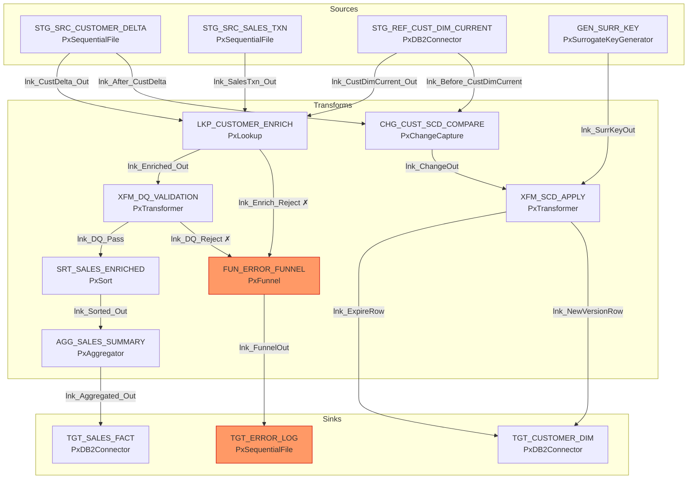

# Discovery: Job Inventory &mdash; JB_CUST_SALES_SCD_AGG

> **Stage:** Job Inventory (discovery / job-inventory)  
> **Date:** 2026-07-28  
> **Source platform:** IBM DataStage  
> **Target platform:** Postgres PySpark  

---

## Overview

| Metric | Count |
|---|---|
| Source platform | IBM DataStage |
| Target platform | Postgres PySpark |
| Total pipelines | 1 |
| Total stages | 14 |
| Total links | 16 |
| Total schemas | 7 |
| Total fields | 58 |

---

## Pipeline: JB_CUST_SALES_SCD_AGG

- **Is primary:** Yes
- **Runtime:** pxOsh
- **Encoding:** UTF-8
- **Description:** Customer/Sales ETL: reference lookup enrichment, data quality gating, SCD Type 2 customer dimension maintenance, sales aggregation to fact table, and centralized reject/error capture.

### Stages

| Label | Op | Role | PySpark method(s) |
|---|---|---|---|
| STG_SRC_CUSTOMER_DELTA | PxSequentialFile | source | `read_source` |
| STG_SRC_SALES_TXN | PxSequentialFile | source | `read_source` |
| STG_REF_CUST_DIM_CURRENT | PxDB2Connector | source | `read_reference` |
| GEN_SURR_KEY | PxSurrogateKeyGenerator | source | `generate_output` |
| LKP_CUSTOMER_ENRICH | PxLookup | transform | `apply_transformations` |
| XFM_DQ_VALIDATION | PxTransformer | transform | `apply_transformations` |
| CHG_CUST_SCD_COMPARE | PxChangeCapture | transform | `apply_transformations` |
| XFM_SCD_APPLY | PxTransformer | transform | `apply_transformations` |
| SRT_SALES_ENRICHED | PxSort | transform | `apply_transformations` |
| AGG_SALES_SUMMARY | PxAggregator | transform | `apply_transformations` |
| FUN_ERROR_FUNNEL | PxFunnel | transform | `apply_transformations` |
| TGT_CUSTOMER_DIM | PxDB2Connector | sink | `ensure_table_exists`, `write_postgres` |
| TGT_SALES_FACT | PxDB2Connector | sink | `ensure_table_exists`, `write_postgres` |
| TGT_ERROR_LOG | PxSequentialFile | sink | `write_output` |

**Notes on node-to-method mapping:**

- **PxDB2Connector as sink** (TGT_CUSTOMER_DIM, TGT_SALES_FACT): Maps to TWO PySpark methods &mdash; `ensure_table_exists()` (DDL creation) and `write_postgres()` (DML data write).
- **PxDB2Connector as source/reference** (STG_REF_CUST_DIM_CURRENT): Maps to ONE method &mdash; `read_reference()`.
- **PxSequentialFile as source** (STG_SRC_CUSTOMER_DELTA, STG_SRC_SALES_TXN): Maps to `read_source()`.
- **PxSequentialFile as sink** (TGT_ERROR_LOG): Maps to `write_output()`.
- **PxSurrogateKeyGenerator** (GEN_SURR_KEY): Maps to `generate_output()` (key source: Db2Sequence EDW.SEQ_CUSTOMER_DIM_KEY).

### Links

| Name | From node | To node | PySpark method |
|---|---|---|---|
| lnk_CustDelta_Out | STG_SRC_CUSTOMER_DELTA | LKP_CUSTOMER_ENRICH | `apply_transformations` |
| lnk_SalesTxn_Out | STG_SRC_SALES_TXN | LKP_CUSTOMER_ENRICH | `apply_transformations` |
| lnk_CustDimCurrent_Out | STG_REF_CUST_DIM_CURRENT | LKP_CUSTOMER_ENRICH | `apply_transformations` |
| lnk_Enriched_Out | LKP_CUSTOMER_ENRICH | XFM_DQ_VALIDATION | `apply_transformations` |
| lnk_Enrich_Reject | LKP_CUSTOMER_ENRICH | FUN_ERROR_FUNNEL | `route_reject` |
| lnk_DQ_Pass | XFM_DQ_VALIDATION | SRT_SALES_ENRICHED | `apply_transformations` |
| lnk_DQ_Reject | XFM_DQ_VALIDATION | FUN_ERROR_FUNNEL | `apply_transformations` |
| lnk_Before_CustDimCurrent | STG_REF_CUST_DIM_CURRENT | CHG_CUST_SCD_COMPARE | `apply_transformations` |
| lnk_After_CustDelta | STG_SRC_CUSTOMER_DELTA | CHG_CUST_SCD_COMPARE | `apply_transformations` |
| lnk_ChangeOut | CHG_CUST_SCD_COMPARE | XFM_SCD_APPLY | `apply_transformations` |
| lnk_SurrKeyOut | GEN_SURR_KEY | XFM_SCD_APPLY | `apply_transformations` |
| lnk_ExpireRow | XFM_SCD_APPLY | TGT_CUSTOMER_DIM | `apply_transformations` |
| lnk_NewVersionRow | XFM_SCD_APPLY | TGT_CUSTOMER_DIM | `apply_transformations` |
| lnk_Sorted_Out | SRT_SALES_ENRICHED | AGG_SALES_SUMMARY | `apply_transformations` |
| lnk_Aggregated_Out | AGG_SALES_SUMMARY | TGT_SALES_FACT | `apply_transformations` |
| lnk_FunnelOut | FUN_ERROR_FUNNEL | TGT_ERROR_LOG | `apply_transformations` |

**Reject links:** `lnk_Enrich_Reject` (Lookup: customer not found in dimension) &mdash; tagged `route_reject`.

### Stage census

| Stage type | Count |
|---|---|
| PxSequentialFile | 3 |
| PxDB2Connector | 3 |
| PxLookup | 1 |
| PxTransformer | 2 |
| PxChangeCapture | 1 |
| PxSurrogateKeyGenerator | 1 |
| PxSort | 1 |
| PxAggregator | 1 |
| PxFunnel | 1 |
| **Total** | **14** |

### Connections (sink targets)

| Target | Kind | Table/File | Write mode | PySpark mode | Method(s) |
|---|---|---|---|---|---|
| TGT_CUSTOMER_DIM | database | EDW.CUSTOMER_DIM | upsert | UNSUPPORTED (merge) | `ensure_table_exists`, `write_postgres` |
| TGT_SALES_FACT | database | EDW.SALES_FACT | insert | append | `ensure_table_exists`, `write_postgres` |
| TGT_ERROR_LOG | file | `#ERR_DIR#/sales_errors_#RUN_DATE#.dat` | overwrite | overwrite | `write_output` |

### Data flow summary

**Two parallel data paths:**

1. **SCD Type 2 path (left):** Customer delta &rarr; Change Capture &rarr; SCD Apply Transformer &rarr; Customer Dimension (upsert).
2. **Sales aggregation path (center):** Sales transactions + dimension reference &rarr; Lookup enrich &rarr; DQ validation &rarr; Sort &rarr; Aggregator &rarr; Sales Fact (insert).
3. **Error funnel path (right):** Rejects from Lookup and DQ validation converge through PxFunnel &rarr; Error Log file.

---

## Reconciliation

All counts verified against `_facts/scan.json`:

| Metric | scan.json | This document | Match |
|---|---|---|---|
| jobs | 1 | 1 | &check; |
| stages | 14 | 14 | &check; |
| links | 16 | 16 | &check; |
| schemas | 7 | 7 | &check; |
| fields | 58 | 58 | &check; |
| connections | 3 | 3 | &check; |
