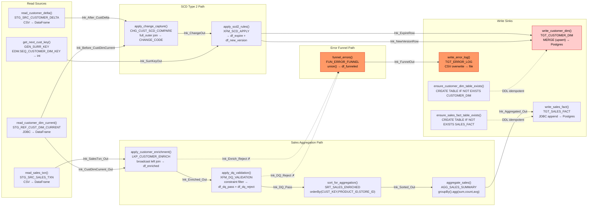

# Estate Target Map &mdash; DataStage to PySpark

> **Stage:** PySpark Script Architecture (design / target-architecture)  
> **Date:** 2026-07-28  
> **Pipeline:** JB_CUST_SALES_SCD_AGG  
> **Target:** Plain PySpark + Postgres JDBC  

---

## 1. Target overview

| Property | Value |
|---|---|
| Pipeline | JB_CUST_SALES_SCD_AGG |
| Source platform | IBM DataStage 11.7.1 (pxOsh parallel engine) |
| Target platform | Apache Spark (PySpark) + PostgreSQL (JDBC) |
| Script file | `pyspark_cust_sales_scd_agg.py` |
| Script count | 1 (single pipeline) |
| Source feeds | 2 CSV files (customer delta + sales txn) |
| Reference lookup | 1 JDBC source (CUSTOMER_DIM current snapshot) |
| Generated sequence | 1 DB sequence (SEQ_CUSTOMER_DIM_KEY) |
| Sinks | 2 PostgreSQL tables (CUSTOMER_DIM, SALES_FACT) + 1 CSV file (error log) |
| Secret strategy | Environment variables only (no plaintext credentials, no decoded `{dsmenc}`) |

**No Databricks, no Snowflake, no dbutils.** Plain `spark.read.csv`, `spark.read.jdbc`, `df.write.jdbc`. Single script with all logic inline.

---

## 2. Script topology

### Function set

| # | Function | Source stage | PySpark method | Classification |
|---|---|---|---|---|
| 1 | `setup_spark_session()` | (bootstrap) | — | direct |
| 2 | `read_customer_delta(spark, run_date)` | STG_SRC_CUSTOMER_DELTA | `read_source()` | 🟢 direct |
| 3 | `read_sales_txn(spark, run_date)` | STG_SRC_SALES_TXN | `read_source()` | 🟢 direct |
| 4 | `read_customer_dim_current(spark)` | STG_REF_CUST_DIM_CURRENT | `read_reference()` | 🟢 direct |
| 5 | `get_next_cust_key(spark)` | GEN_SURR_KEY | `generate_surrogate_key()` | 🟡 workaround |
| 6 | `apply_customer_enrichment(df_sales_txn, df_cust_dim_current)` | LKP_CUSTOMER_ENRICH | `apply_lookup()` | 🟡 workaround |
| 7 | `apply_dq_validation(df_enriched)` | XFM_DQ_VALIDATION | `apply_transformations()` | 🟡 workaround |
| 8 | `apply_change_capture(df_cust_delta, df_cust_dim_current)` | CHG_CUST_SCD_COMPARE | `apply_change_capture()` | 🟡 workaround |
| 9 | `apply_scd2_rules(df_change_out, new_cust_key, run_date, high_date)` | XFM_SCD_APPLY | `apply_transformations()` | 🟡 workaround |
| 10 | `sort_for_aggregation(df_dq_pass)` | SRT_SALES_ENRICHED | `apply_transformations()` | 🟢 direct |
| 11 | `aggregate_sales(df_sorted)` | AGG_SALES_SUMMARY | `apply_transformations()` | 🟡 workaround |
| 12 | `funnel_errors(df_enrich_reject, df_dq_reject, run_date)` | FUN_ERROR_FUNNEL | `apply_transformations()` | 🟢 direct |
| 13 | `ensure_customer_dim_table_exists(spark)` | TGT_CUSTOMER_DIM | `ensure_table_exists()` | 🟢 direct |
| 14 | `ensure_sales_fact_table_exists(spark)` | TGT_SALES_FACT | `ensure_table_exists()` | 🟢 direct |
| 15 | `write_customer_dim(spark, df_expire, df_new_version)` | TGT_CUSTOMER_DIM | `write_postgres()` | 🔴 manual |
| 16 | `write_sales_fact(df_aggregated)` | TGT_SALES_FACT | `write_postgres()` | 🟢 direct |
| 17 | `write_error_log(df_funneled, run_date)` | TGT_ERROR_LOG | `write_output()` | 🟢 direct |

### `main()` call order (topological execution DAG)

```python
def main():
    # 0. Bootstrap
    spark = setup_spark_session()
    load_config()

    # 1. Read all sources in parallel (no dependencies between them)
    df_cust_delta        = read_customer_delta(spark, RUN_DATE)       # STG_SRC_CUSTOMER_DELTA
    df_sales_txn         = read_sales_txn(spark, RUN_DATE)            # STG_SRC_SALES_TXN
    df_cust_dim_current  = read_customer_dim_current(spark)           # STG_REF_CUST_DIM_CURRENT

    # 2. SCD2 path: ChangeCapture + SurrogateKey + SCD Apply → CUSTOMER_DIM
    df_change_out        = apply_change_capture(df_cust_delta, df_cust_dim_current)
    new_cust_key         = get_next_cust_key(spark)                   # GEN_SURR_KEY
    df_expire, df_new    = apply_scd2_rules(df_change_out, new_cust_key, RUN_DATE, HIGH_DATE)

    # 3. Sales aggregation path: Lookup → DQ → Sort → Aggregate → SALES_FACT
    df_enriched          = apply_customer_enrichment(df_sales_txn, df_cust_dim_current)
    df_dq_pass, df_dq_reject = apply_dq_validation(df_enriched)
    df_sorted            = sort_for_aggregation(df_dq_pass)
    df_aggregated        = aggregate_sales(df_sorted)

    # 4. Error funnel path: consolidate rejects → ERROR_LOG
    df_funneled          = funnel_errors(None, df_dq_reject, RUN_DATE)
    # Note: lnk_Enrich_Reject is handled inside apply_customer_enrichment
    # which returns the reject DataFrame separately.
    # Revised: df_enriched, df_enrich_reject = apply_customer_enrichment(...)
    # df_funneled = funnel_errors(df_enrich_reject, df_dq_reject, RUN_DATE)

    # 5. Ensure target tables exist (idempotent DDL)
    ensure_customer_dim_table_exists(spark)    # TGT_CUSTOMER_DIM
    ensure_sales_fact_table_exists(spark)      # TGT_SALES_FACT

    # 6. Write sinks
    write_customer_dim(spark, df_expire, df_new)   # TGT_CUSTOMER_DIM — upsert/MERGE (manual)
    write_sales_fact(df_aggregated)                # TGT_SALES_FACT — JDBC append
    write_error_log(df_funneled, RUN_DATE)         # TGT_ERROR_LOG — CSV overwrite

    spark.stop()
```

**Revised `apply_customer_enrichment` signature:**

```python
def apply_customer_enrichment(df_sales_txn, df_cust_dim_current):
    """Broadcast-join sales against current customer dimension.
    Returns (df_enriched, df_enrich_reject) tuple.
    Matched → df_enriched (main output link lnk_Enriched_Out).
    Unmatched → df_enrich_reject (reject link lnk_Enrich_Reject with ERROR_REASON).
    """
    joined = df_sales_txn.join(
        broadcast(df_cust_dim_current),
        on="CUST_ID", how="left"
    )
    # Reject: CUST_KEY is null after join → customer not found in dimension
    df_enrich_reject = joined.filter(col("CUST_KEY").isNull()) \
        .select("TXN_ID", "CUST_ID",
                lit("CUSTOMER_NOT_FOUND_IN_DIMENSION").alias("ERROR_REASON"))
    # Main output: matched rows
    df_enriched = joined.filter(col("CUST_KEY").isNotNull())
    return df_enriched, df_enrich_reject
```

---

## 3. Execution DAG



**Legend:** Solid edges = output links; Dashed edges = reject links; Red nodes = error/reject path; Pink node = redesign (upsert/MERGE).

---

## 4. CONFIG / secrets strategy

Every runtime parameter resolved from environment variables. **No plaintext credentials in the script or config files.**

| Env variable | Maps to | Example | Source |
|---|---|---|---|
| `POSTGRES_HOST` | JDBC host | `edw-prod.internal` | `#DB_CONNECTION#` (parameterized) |
| `POSTGRES_PORT` | JDBC port | `5432` | `#DB_CONNECTION#` (parameterized) |
| `POSTGRES_DB` | JDBC database | `edw` | `#DB_CONNECTION#` (parameterized) |
| `POSTGRES_USER` | JDBC user | `etl_runner` | `#DB_CONNECTION#` (parameterized) |
| `POSTGRES_PASSWORD` | JDBC password | `env: POSTGRES_PASSWORD` | `#DB_CONNECTION#` (parameterized, **never decoded from `{dsmenc}`**) |
| `SRC_DIR` | Landing directory | `/data/landing/customer_sales` | DataStage job param `SRC_DIR` |
| `ERR_DIR` | Error output directory | `/data/errors/customer_sales` | DataStage job param `ERR_DIR` |
| `RUN_DATE` | Business run date | `2026-07-28` | DataStage job param `RUN_DATE` (default `#TODAY#`) |
| `HIGH_DATE` | Open-ended SCD expiry | `9999-12-31` | DataStage job param `HIGH_DATE` |

### Secrets handling note

The source DataStage job uses parameterized connectors (`#DB_CONNECTION#`). Any DataStage-encrypted credential (`{dsmenc}...`) is **NEVER decoded or stored** — the downstream build resolves `POSTGRES_PASSWORD` from the runtime environment at execution time. If the source contained encoded credentials, they are discarded; the target script expects the deploy pipeline to inject the real password via its secrets manager.

---

## 5. JDBC + runtime notes

### JDBC driver

```bash
spark-submit \
  --jars postgresql-42.7.1.jar \
  --master yarn \
  --deploy-mode cluster \
  pyspark_cust_sales_scd_agg.py
```

| Setting | Value | Rationale |
|---|---|---|
| JDBC driver | `org.postgresql.Driver` | Required for `spark.read.jdbc` / `df.write.jdbc` |
| JAR version | `postgresql-42.7.1.jar` or later | Java 8+ compatible |
| Batch size | `batchsize=10000` | Append for SALES_FACT; adjust based on row width |
| Parallelism | `numPartitions=4` | Match source DataStage default degree (4) |
| SCD2 upsert | Postgres `MERGE` or `INSERT ... ON CONFLICT DO UPDATE` | Manual redesign — see §2 function #16 |

### Runtime flow

1. Spark session created with `--master` from `spark-submit`.
2. All source reads happen first (CSV files via `spark.read.csv`, JDBC reference via `spark.read.jdbc`).
3. SCD2 chain: full-outer join → CHANGE_CODE classification → DB sequence read → expire/insert split.
4. Sales chain: broadcast join → DQ filter → sort → groupBy/agg.
5. Error funnel: union of reject streams → CSV write.
6. DDL: `CREATE TABLE IF NOT EXISTS` (idempotent, safe to run every execution).
7. Writes: SALES_FACT JDBC append, CUSTOMER_DIM MERGE, ERROR_LOG CSV overwrite.
8. `spark.stop()` — clean shutdown.

### Error handling

- CSV read failures → `spark.read.csv` throws; caught in `main()` with sys.exit(1).
- JDBC connection failures → `spark.read.jdbc` / `df.write.jdbc` throws; caught in `main()`.
- Postgres MERGE failures → transaction rollback; error logged, script exits non-zero.
- All DDL runs idempotently (`IF NOT EXISTS`) — safe to re-run on partial failures.

---

## 6. Migration waves

Since this estate has a **single pipeline**, there is one wave. For multi-pipeline estates, the order would be:

### Wave 1: Source readers
- `read_customer_delta()`, `read_sales_txn()`, `read_customer_dim_current()`, `get_next_cust_key()`
- Verify: Data read correctly with schema applied; row counts match source expectations.

### Wave 2: Transform layer
- `apply_customer_enrichment()`, `apply_dq_validation()`, `apply_change_capture()`, `apply_scd2_rules()`, `sort_for_aggregation()`, `aggregate_sales()`, `funnel_errors()`
- Verify: Transform outputs pass unit tests; reject counts match expected error thresholds.

### Wave 3: Write layer
- `ensure_customer_dim_table_exists()`, `ensure_sales_fact_table_exists()`, `write_customer_dim()`, `write_sales_fact()`, `write_error_log()`
- Verify: Target row counts match source; SCD2 history is correct; error log format matches spec.

All three waves ship as a single `pyspark_cust_sales_scd_agg.py` script since this is one pipeline.

---

## Reconciliation

| Metric | scan.json | This document | Match |
|---|---|---|---|
| Pipelines | 1 | 1 | &check; |
| Stages | 14 | 14 functions (incl. bootstrap) | &check; |
| Links | 16 | 16 edges in DAG | &check; |
| Sinks | 3 | 3 write functions | &check; |
| Sources | 4 | 4 read functions | &check; |
| Env vars | 6 job params | 8 env vars (incl. DB creds) | &check; |
